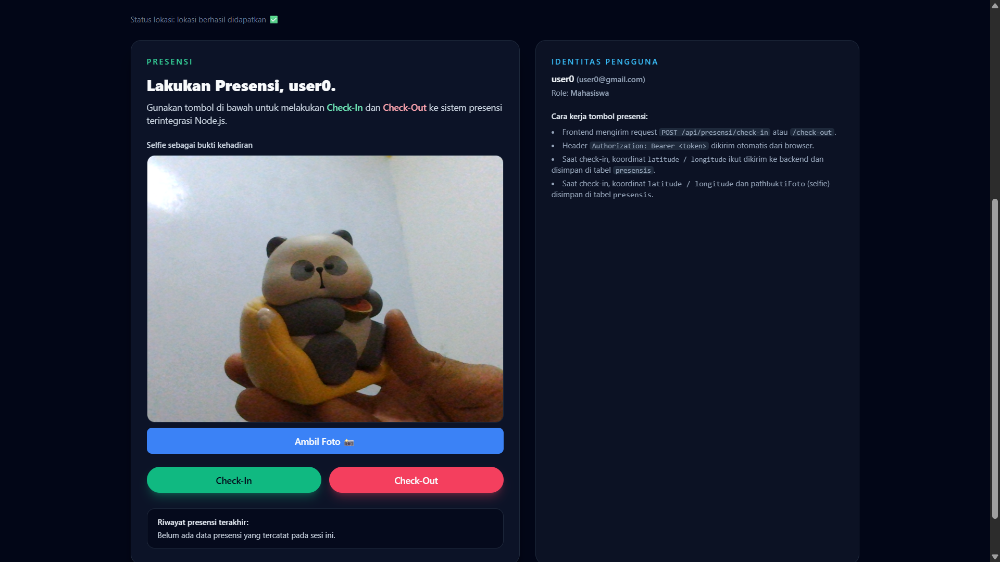
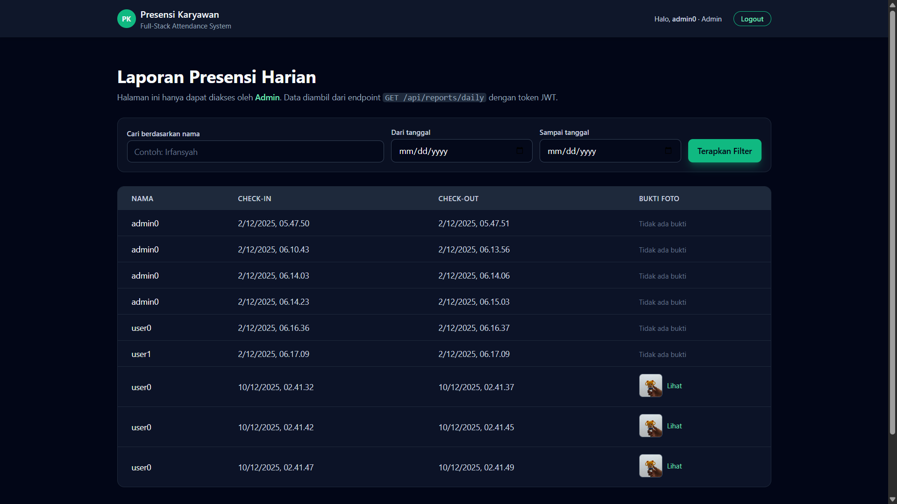
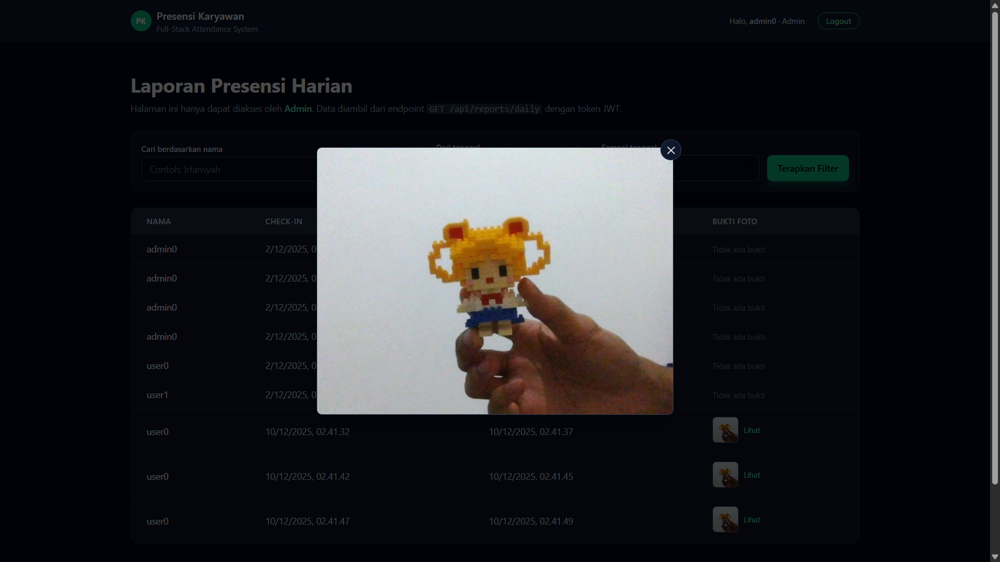
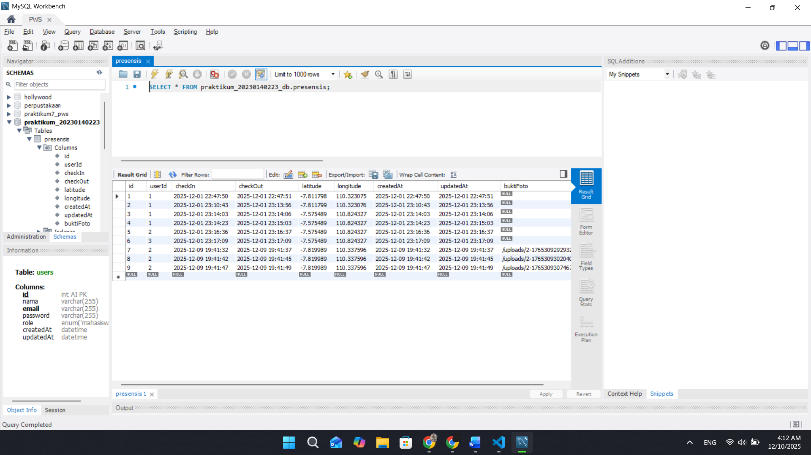

# Tugas 10 - Implementasi Sensor Kamera (Selfie Check-in) & File Handling

## 1. Halaman PresensiPage menampilkan kamera (react-webcam)

## 2. Halaman ReportPage dengan kolom baru “Bukti Foto”

## 3. Popup / modal foto ukuran penuh saat thumbnail di-klik

## 4. Tabel database presensis yang berisi path buktiFoto
