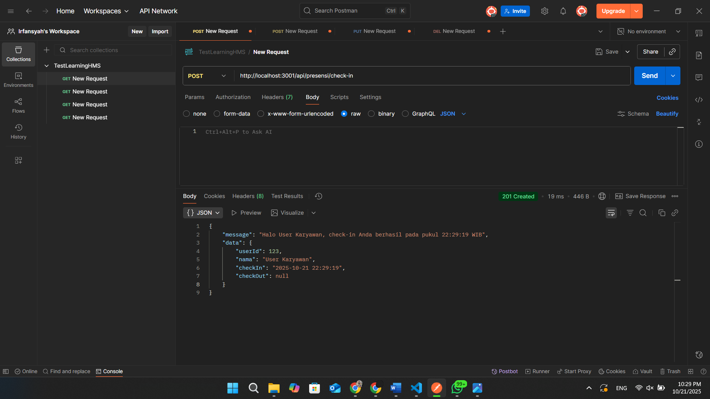
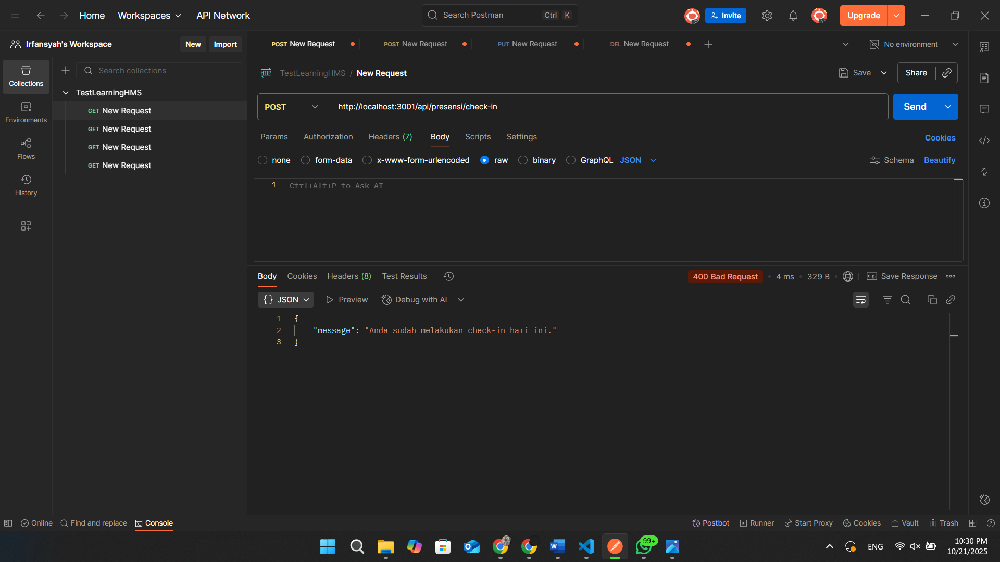
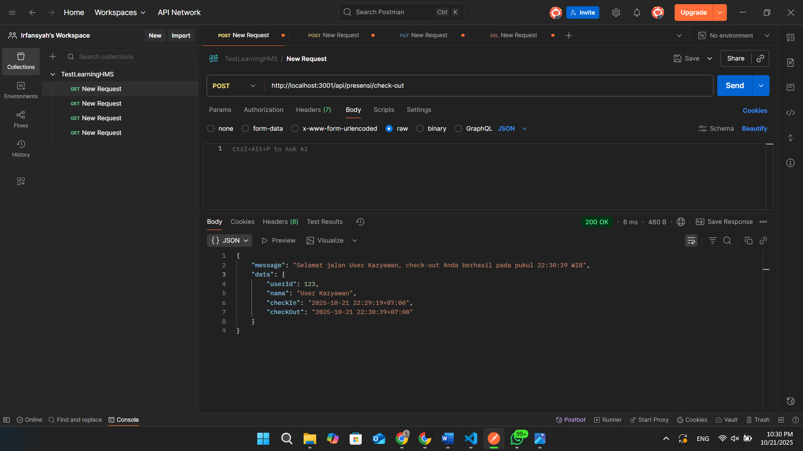
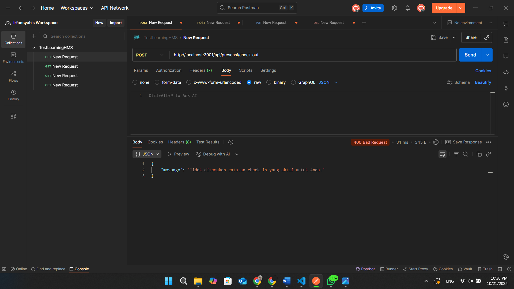
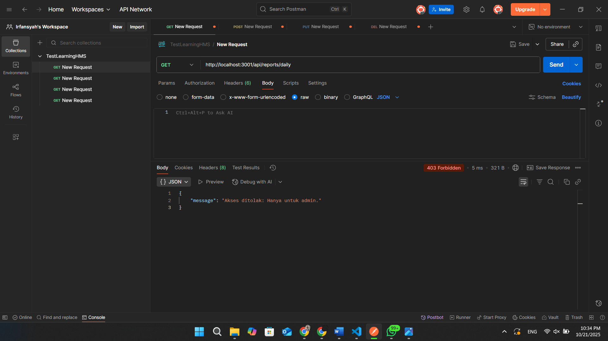
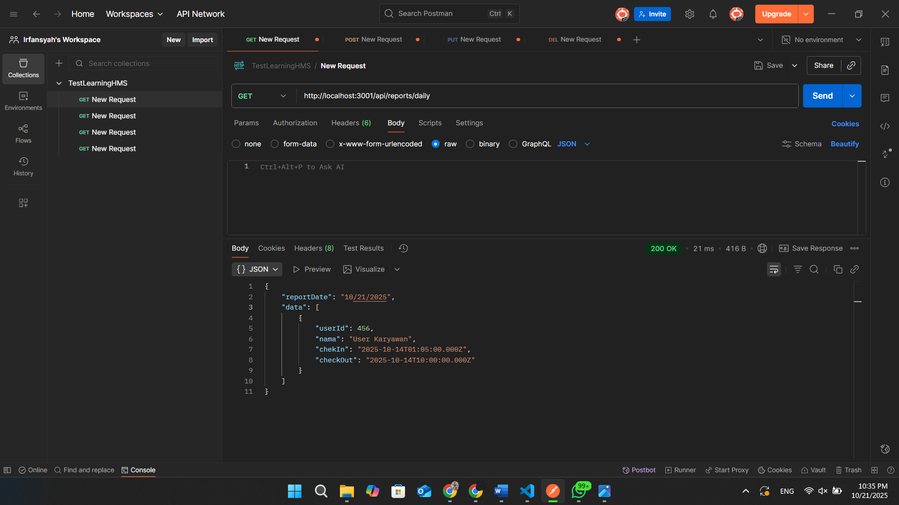

# Tugas 3

## Tampilan Endpoint presensi/check-in

## Tampilan Endpoint presensi/check-in jika dilakukan lebih dari 1 kali

## Tampilan Endpoint presensi/check-out

## Tampilan Endpoint presensi/check-out jika belum melakukan check-in

## Tampilan Endpoint reports/daily
- Sebagai role Karyawan

- Sebagai role Admin
