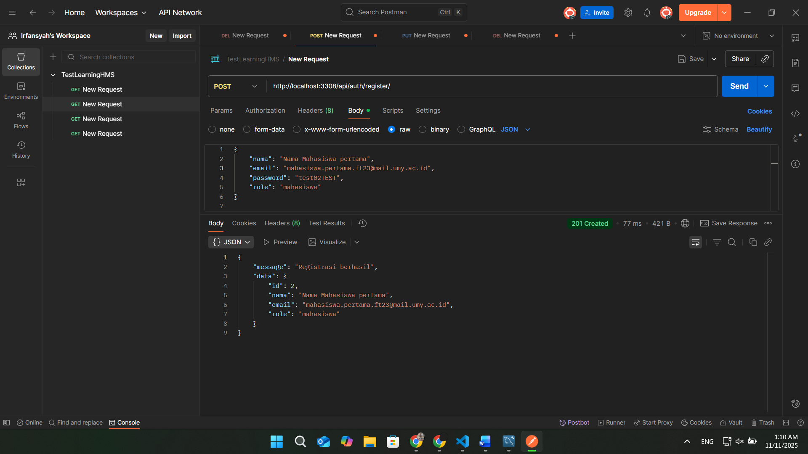
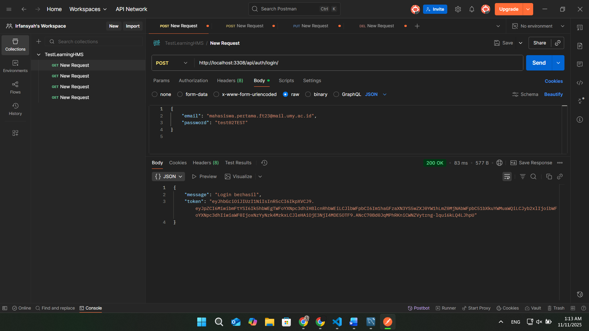
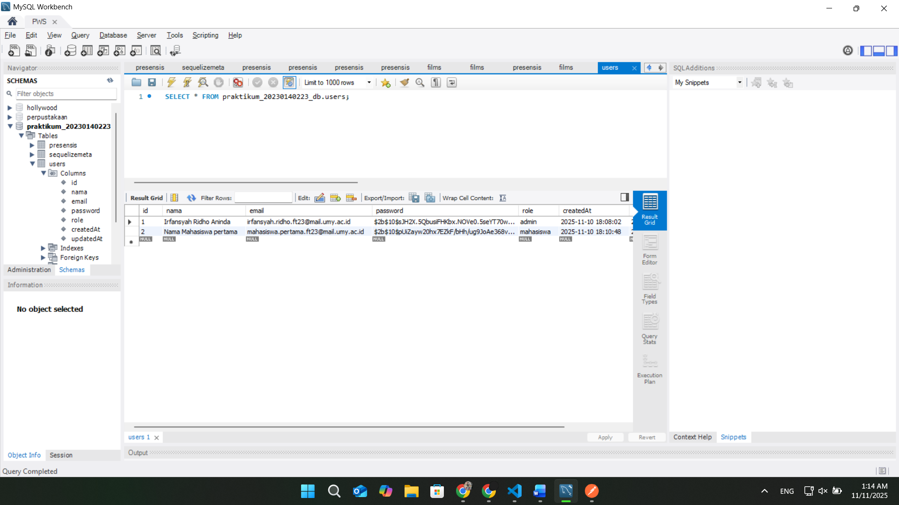

# Tugas 6

## Request POST /register (untuk membuat user "mahasiswa")

## Request POST /register (untuk membuat user "admin").

## Request POST /login (login sebagai "mahasiswa" dan mendapatkan token).

## Database table users
