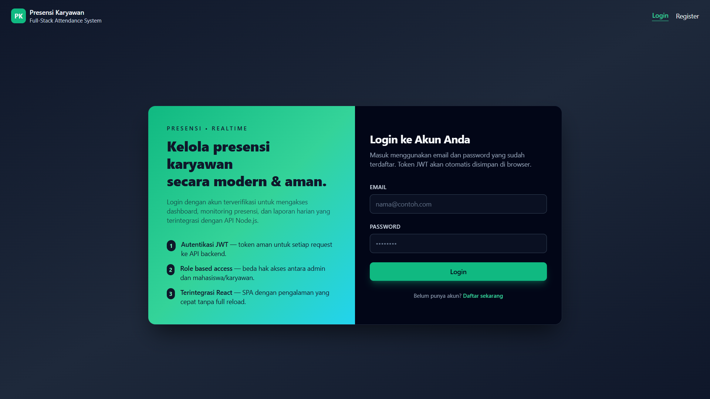
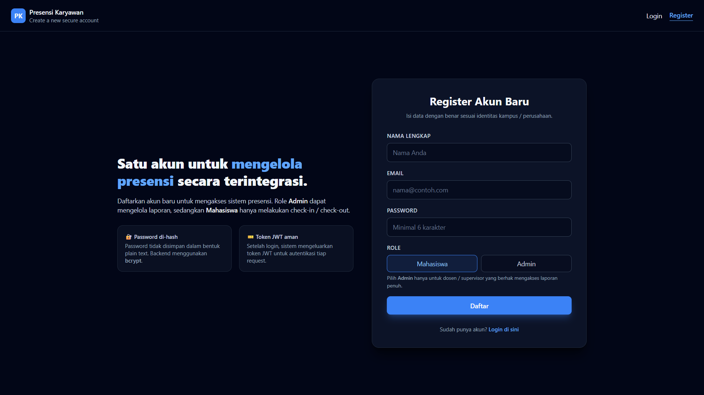
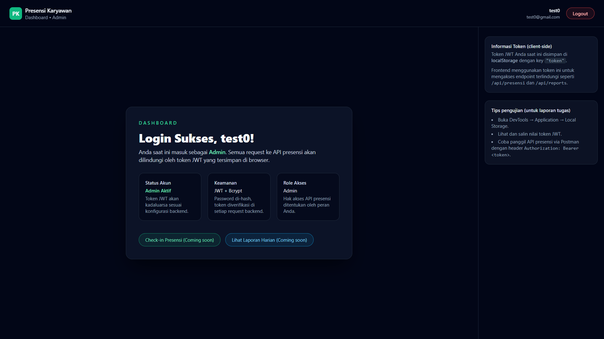

# Tugas 7 – Integrasi Frontend React dengan Backend API (Autentikasi)

Nama : Irfansyah  
NIM  : 20230140223  
Mata Kuliah : Pengembangan Aplikasi Web  
Topik : Integrasi React + Node.js (JWT Auth) untuk Presensi Karyawan

Dokumen ini berisi **tangkapan layar (screenshot)** dari 3 halaman utama aplikasi:

1. Login Page  
2. Register Page  
3. Dashboard Page  

---

## 1. Login Page

**Deskripsi Singkat**

- Halaman login dibangun menggunakan **React** dan **Tailwind CSS**.
- Layout terdiri dari:
  - Panel informasi di sisi kiri yang menjelaskan fitur sistem presensi (autentikasi JWT, role-based access, integrasi React & Node.js).
  - Panel form login di sisi kanan dengan tampilan card ber-background gelap.
- Field yang tersedia:
  - **Email**
  - **Password**
- Saat tombol **Login** ditekan:
  - Frontend mengirim request `POST` ke endpoint `http://localhost:3308/api/auth/login` menggunakan **axios**.
  - Jika login berhasil, backend mengembalikan **JWT token**.
  - Token disimpan di `localStorage` dan user diarahkan ke halaman **Dashboard** (`/dashboard`).
  - Jika gagal, pesan error tampil di bawah form.

---

## 2. Register Page

**Deskripsi Singkat**

- Halaman registrasi juga menggunakan **React + Tailwind CSS** dengan gaya UI konsisten dengan halaman login.
- Form register berisi field:
  - **Nama Lengkap**
  - **Email**
  - **Password**
  - **Role** (dropdown: `mahasiswa` atau `admin`)
- Alur ketika tombol **Daftar** ditekan:
  - Frontend mengirim request `POST` ke endpoint `http://localhost:3308/api/auth/register`.
  - Backend menyimpan data user ke tabel **Users** dengan password yang sudah di-hash menggunakan **bcrypt**.
  - Jika registrasi berhasil:
    - Muncul pesan sukses di bawah form.
    - User otomatis diarahkan ke halaman **Login**.
  - Jika email sudah terdaftar atau input tidak valid:
    - Muncul pesan error dari backend.

---

## 3. Dashboard Page

**Deskripsi Singkat**

- Halaman Dashboard hanya bisa diakses setelah user **berhasil login** dan memiliki token JWT yang valid.
- Pada saat halaman di-render:
  - Frontend mengambil token dari `localStorage`.
  - Token didecode menggunakan library **`jwt-decode`**.
  - Nama user (`payload.nama`) ditampilkan pada teks sapaan:  
    **“Selamat Datang, [nama user].”**
- Elemen utama pada halaman:
  - Card utama dengan teks **“Login Sukses!”** dan sapaan personal.
  - Penjelasan singkat bahwa user sudah berada di halaman Dashboard.
  - Tombol **Logout** berwarna merah.

**Fungsi Logout**

- Saat tombol **Logout** diklik:
  - Token dihapus dari `localStorage` dengan `localStorage.removeItem('token')`.
  - User diarahkan kembali ke halaman **Login** menggunakan `useNavigate()` dari `react-router-dom`.
  - Dengan demikian, user harus login ulang untuk mendapatkan token baru sebelum bisa mengakses Dashboard lagi.

---

## Ringkasan Teknis

- **Frontend**
  - Framework : React (Create React App)
  - Routing    : `react-router-dom`
  - Styling    : Tailwind CSS (via CDN di `public/index.html`)
  - HTTP Client: axios
  - JWT Decode : `jwt-decode`
- **Backend (dari praktikum sebelumnya)**
  - Platform   : Node.js + Express
  - Database   : Sequelize + MySQL
  - Auth       : `bcryptjs` untuk hashing password, `jsonwebtoken` untuk generate JWT
  - Endpoint penting:
    - `POST /api/auth/register`
    - `POST /api/auth/login`
    - Endpoint presensi yang dilindungi middleware autentikasi JWT.

Aplikasi ini sudah mengimplementasikan alur **Register → Login → Simpan JWT di localStorage → Akses Dashboard → Logout** secara penuh.
