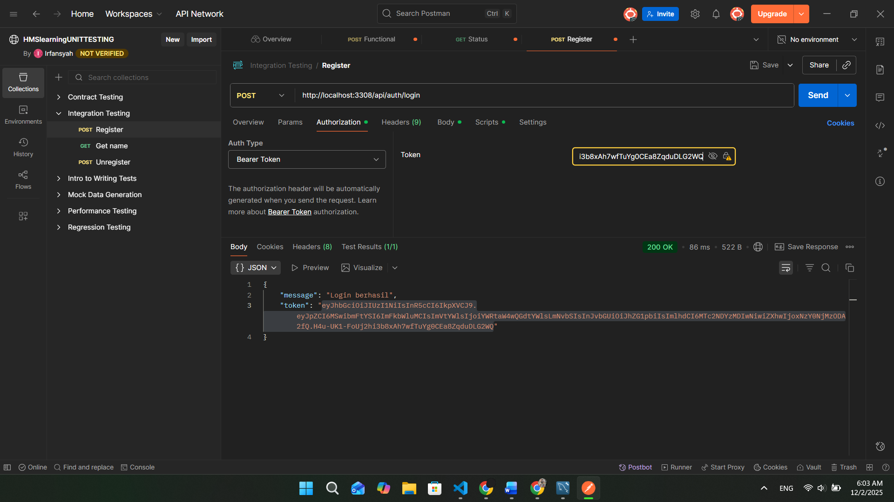
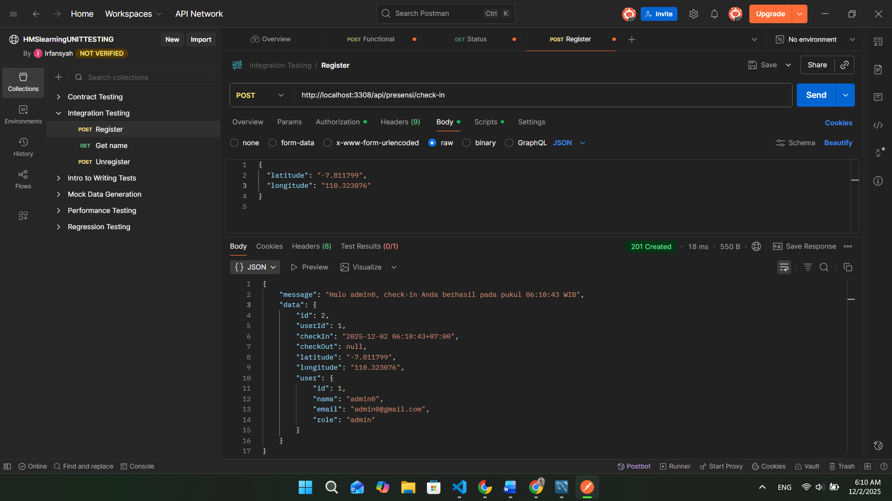
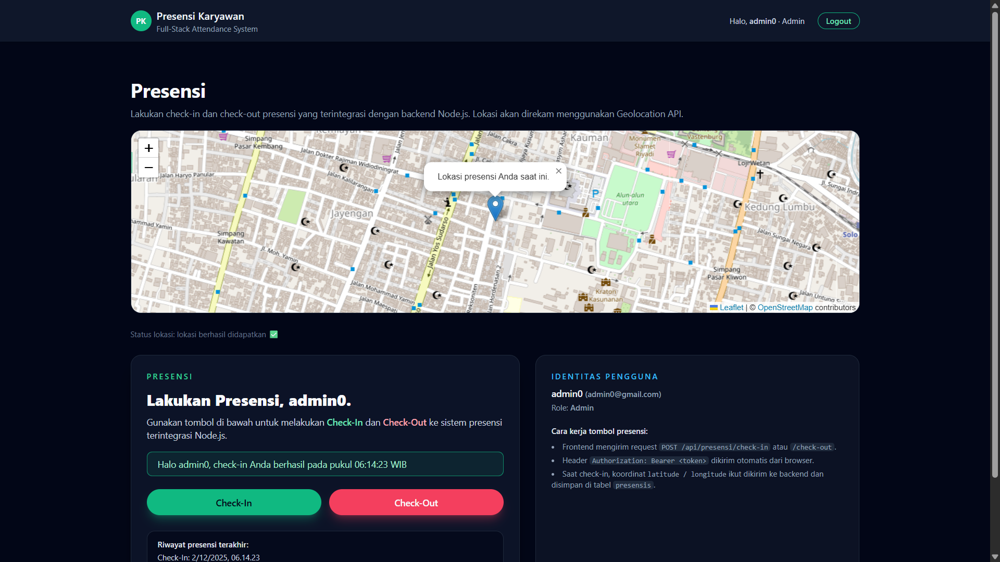
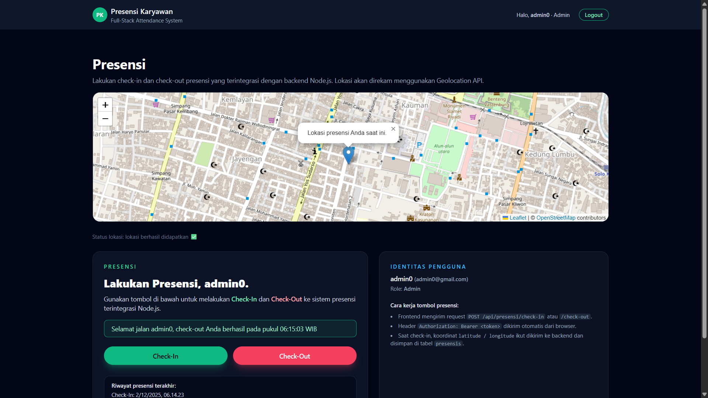
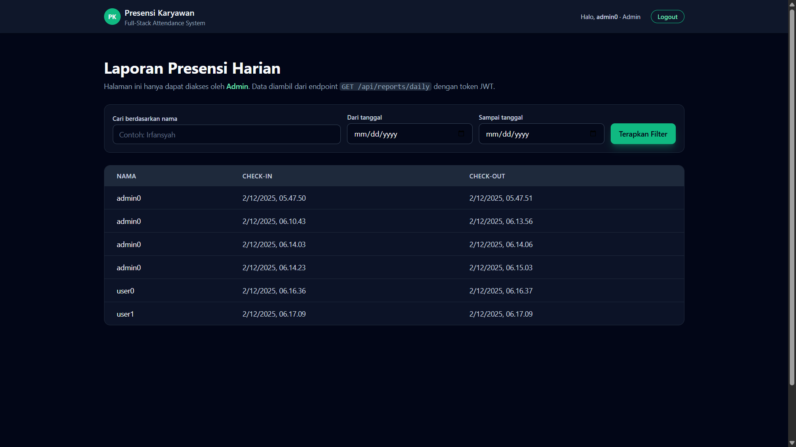
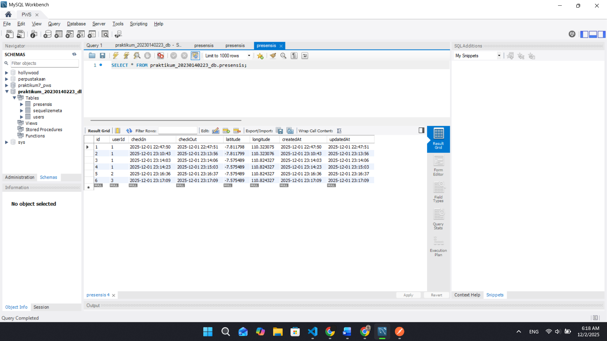

# Tugas 9 - Integrasi Final Full-Stack, Relasi Database, dan Geolocation

## 1. Endpoint presensi/check-in dengan menggunakan bearer token dan body latitude, longitude

## 2. Tampilan halaman presensi dengan menampilkan maps OSM:

**a. Check-In berhasil**

**b. Check-Out berhasil**

## 3. Tampilan halaman report yg berisi data presensi dari semua user

## 4. Screenshote tabel presensi di database
